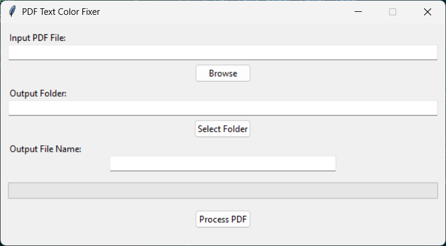

# PDF Text Color Fixer Tool

  
_(Replace with actual screenshot of your application)_

## Introduction

This simple GUI tool helps you convert colored text in PDF files to black text while preserving the original layout. It's particularly useful when:

- You need to print a PDF but want to save ink by converting all text to black
- Your PDF contains light-colored text that's hard to read
- You want to standardize text color in a document
- Purge images in the PDF

The tool maintains all formatting, fonts, and positioning while only changing the text color.

## Prerequisites

- Python 3.6 or higher
- pip (Python package manager)

## Installation

1. **Download the project files**  
   Click the "Code" button above and download as a ZIP file, or clone the repository if you're familiar with Git.

2. **Install required packages**  
   Open a terminal/command prompt in the project folder and run:

   ```bash
   pip install -r requirements.txt
   ```

   _(If you don't have a requirements.txt file, use this command instead:)_

   ```bash
   pip install pymupdf tk
   ```

## How to Use

1. **Launch the application**  
   Run the script with Python:

   ```bash
   python pdf_text_fixer.py
   ```

2. **Select your PDF file**

   - Click "Browse" to select the input PDF file
   - The output filename will be automatically suggested (original name + "\_black.pdf")

3. **Choose output location**

   - Click "Select Folder" to choose where to save the processed file
   - You can edit the output filename if needed

4. **Process the file**  
   Click "Process PDF" and wait for the progress bar to complete

5. **Done!**  
   Your new PDF with black text will be saved in the specified location

## Features

- Simple, user-friendly interface
- Preserves original document layout and formatting
- Progress bar shows conversion status
- Handles most standard PDF fonts
- Lightweight and fast processing

## Troubleshooting

If you encounter any issues:

1. **Missing packages error**  
   Make sure you installed all requirements with `pip install -r requirements.txt`

2. **Font issues**  
   The tool works best with standard PDF fonts. Some custom fonts might not be preserved perfectly.

3. **Permission errors**  
   Make sure you have write permissions in the output folder you selected.

## Support

For questions or issues, please [open an issue](https://github.com/yourusername/yourrepository/issues) in the project repository.

---

_Note: This tool is designed for simple PDF documents. Complex PDFs with special formatting or embedded images might not process perfectly._
